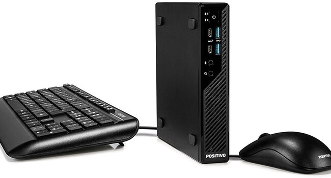
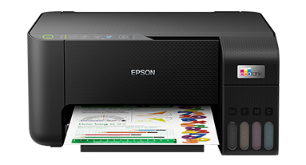
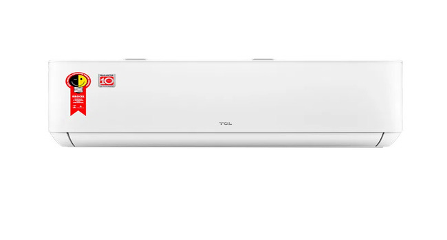

<!DOCTYPE html>
<html lang="pt-br">
    <head>
        <meta charset="utf-8" />
        <meta name="viewport" content="width=device-width, initial-scale=1, shrink-to-fit=no" />
        <meta name="description" content="" />
        <meta name="author" content="" />
        <title>Olmi Informática</title>
        <!-- Favicon-->
        <link rel="icon" type="image/x-icon" href="assets/logo.jpg" />
        <!-- Bootstrap Icons-->
        <link href="https://cdn.jsdelivr.net/npm/bootstrap-icons@1.5.0/font/bootstrap-icons.css" rel="stylesheet" />
        <!-- Google fonts-->
        <link href="https://fonts.googleapis.com/css?family=Merriweather+Sans:400,700" rel="stylesheet" />
        <link href="https://fonts.googleapis.com/css?family=Merriweather:400,300,300italic,400italic,700,700italic" rel="stylesheet" type="text/css" />
        <!-- SimpleLightbox plugin CSS-->
        <link href="https://cdnjs.cloudflare.com/ajax/libs/SimpleLightbox/2.1.0/simpleLightbox.min.css" rel="stylesheet" />
        <!-- Core theme CSS (includes Bootstrap)-->
        <link href="css/styles.css" rel="stylesheet" />
    </head>
    <body id="page-top">
        <!-- Navigation-->
        <nav class="navbar navbar-expand-lg navbar-light fixed-top py-3" id="mainNav">
            

                <a class="navbar-brand" href="#page-top">Olmi Informática</a>
                <button class="navbar-toggler navbar-toggler-right" type="button" data-bs-toggle="collapse" data-bs-target="#navbarResponsive" aria-controls="navbarResponsive" aria-expanded="false" aria-label="Toggle navigation"></button>
                

                    <ul class="navbar-nav ms-auto my-2 my-lg-0">
                        <li class="nav-item"><a class="nav-link" href="#about">Sobre</a></li>
                        <!--<li class="nav-item"><a class="nav-link" href="#services">LOREM IPSUM</a></li>-->
                        <li class="nav-item"><a class="nav-link" href="#portfolio">Atas</a></li>
                        <li class="nav-item"><a class="nav-link" href="#contact">Contato</a></li>
                    </ul>
                

            

        </nav>
        <!-- Masthead-->
        <header class="masthead">
            

                

                    

                        <h1 class="text-white font-weight-bold">Um título aqui</h1>
                        

                    

                    

                        
Lorem ipsum dolor sit amet, consectetur adipiscing elit. Morbi dictum, dui sed blandit ultricies, nisi erat gravida quam, sed commodo felis ipsum in est. Duis in dolor ante. Ut fermentum tristique elementum. In cursus hendrerit augue. Duis pretium sem felis, et maximus neque faucibus vehicula. Etiam et lacus nec mauris ultrices laoreet. In et mi vitae neque laoreet dictum. Donec sed felis dolor. Integer feugiat lectus lorem, feugiat vestibulum eros suscipit a.

                        <!--<a class="btn btn-primary btn-xl" href="#about">Continue lendo</a>-->
                    

                

            

        </header>
        <!-- About-->
        <section class="page-section bg-blue" id="about">
            

                

                    

                        <h2 class="text-dark mt-0">Sobre</h2>
                        

                        
Lorem ipsum dolor sit amet, consectetur adipiscing elit. Morbi dictum, dui sed blandit ultricies, nisi erat gravida quam, sed commodo felis ipsum in est. Duis in dolor ante. Ut fermentum tristique elementum. In cursus hendrerit augue. Duis pretium sem felis, et maximus neque faucibus vehicula. Etiam et lacus nec mauris ultrices laoreet. In et mi vitae neque laoreet dictum. Donec sed felis dolor. Integer feugiat lectus lorem, feugiat vestibulum eros suscipit a.

                        
Nulla sed risus ipsum. Proin sed sodales nisl, ut feugiat est. Pellentesque mollis porttitor ipsum vitae vestibulum. Maecenas facilisis tellus erat, a venenatis nunc suscipit sit amet. Praesent in lorem at mauris tincidunt mattis quis vitae purus. Sed nec odio venenatis, mattis est eget, finibus nunc. Duis pharetra diam sit amet neque mattis porta. In eu magna sit amet quam pellentesque semper sit amet vel odio. Vivamus nec enim volutpat, volutpat magna eget, venenatis velit.

                        
Curabitur mattis varius dui. Proin ligula sapien, pulvinar tincidunt sapien et, suscipit bibendum purus. Nullam interdum ante vitae dui maximus vehicula. Aliquam quis lacinia lectus. Cras dolor odio, pellentesque sit amet justo eu, scelerisque gravida lectus. Vestibulum ante ipsum primis in faucibus orci luctus et ultrices posuere cubilia curae; Donec ultricies commodo lectus, non dapibus velit volutpat a. Suspendisse libero nisl, condimentum eu aliquam sit amet, tristique et enim. Morbi eu ante arcu. Sed viverra velit nec purus sodales, et blandit felis congue.

                        
Nulla nec faucibus ex. Nullam scelerisque id metus non sodales. Nunc a tortor tortor. Praesent in ornare erat. Duis ultrices venenatis nisl, faucibus mattis ipsum consectetur a. Vestibulum egestas purus eu ornare posuere. Quisque laoreet pellentesque ipsum. Phasellus quis condimentum nisl. Integer eget fringilla tortor. Vestibulum tortor augue, luctus eget iaculis eget, tristique mattis eros.

                    

                

            

        </section>
        <!-- Services-->
        <section class="page-section" id="services">
            

                <h2 class="text-dark text-center mt-0">Atendemos órgãos públicos em diversas modalidades</h2>
                

                

                    

                        <!--
                        

                            
<i class="bi-gem fs-1 text-primary"></i>

                            <h3 class="h4 mb-2">Sturdy Themes</h3>
                            
Our themes are updated regularly to keep them bug free!

                        

                        -->
                    

                    

                        

                            
<!--<i class="bi-laptop fs-1 text-primary"></i>-->

                            <h3 class="h4 mb-2">Modalidades</h3>
                            
Pregões Eletrônicos. 
                            Compras Diretas. 
                            Pregões Presenciais. 
                            Adesões.

                        

                    

                    

                        

                            
<!--<i class="bi-globe fs-1 text-primary"></i>-->

                            <h3 class="h4 mb-2">Onde atendemos</h3>
                            
Mato Grosso. 
                            Rondônia.

                        

                    

                    

                        <!--
                        

                            
<i class="bi-heart fs-1 text-primary"></i>

                            <h3 class="h4 mb-2">Made with Love</h3>
                            
Is it really open source if it's not made with love?

                        

                        -->
                    

                

            

        </section>
        <!-- Portfolio-->
        

            

                

                    

                        

                            
                            

                                
Desktops, Monitores e Notebooks

                                <!-- 
Project Name
 -->
                            

                        

                    

                    

                        

                            
                            

                                
Tablets e Smartphones

                                <!-- 
Project Name
 -->
                            

                        

                    

                    

                        <a class="portfolio-box" title="Impressoras e Scanners">
                            
                            

                                
Impressoras e Scanners

                                <!-- 
Project Name
 -->
                            

                        </a>
                    

                    

                        

                            
                            

                                
Televisores

                                <!-- 
Project Name
 -->
                            

                        

                    

                    

                        

                            
                            

                                
Condicionadores de ar

                                <!-- 
Project Name
 -->
                            

                        

                    

                    

                        

                            
                            

                                
Eletrodomésticos

                                <!-- 
Project Name
 -->
                            

                        

                    

                

            

        

        <!-- ACESSO A ATAS -->
        <section class="page-section bg-blue">
            

                <h2 class="mb-4">Gostaria de verificar os produtos e quantidades registradas em Atas?</h2>
                <a class="btn btn-light btn-xl" href="assets/docs/teste-atas.pdf" target="_blank">Acessar Atas</a>
            

        </section>
        <!-- CONTATO -->
        <section class="page-section" id="contact">
            

                

                    

                        <h2 class="mt-0">Contate-nos!</h2>
                        

                        
Se interessou por alguma de nossas Atas? Nos envie-nos uma mensagem e iremos respondê-la o mais rápido possível!

                    

                

                

                    

                        <!-- FORMULÁRIO -->
                        <form id="contactForm" action="send_email.php" method="POST" data-sb-form-api-token="API_TOKEN">
                            <!-- NOME -->
                            

                                <input class="form-control" id="name" name="name" type="text" placeholder="Enter your name..." data-sb-validations="required" />
                                <label for="name">Nome completo</label>
                                
É necessário inserir um nome.

                            

                            <!-- EMAIL -->
                            

                                <input class="form-control" id="email" type="email" name="email" placeholder="name@example.com" data-sb-validations="required,email" />
                                <label for="email">Endereço de e-mail</label>
                                
É necessário inserir um endereço de e-mail.

                                
Este endereço de e-mail não é válido.

                            

                            <!-- TELEFONE -->
                            

                                <input class="form-control" id="phone" name="phone" type="tel" placeholder="(123) 456-7890" data-sb-validations="required" />
                                <label for="phone">Telefone</label>
                                
É necessário inserir um número de telefone.

                            

                            <!-- MENSAGEM -->
                            

                                <textarea class="form-control" id="message" name="message" type="text" placeholder="Insira sua mensagem aqui..." style="height: 10rem" data-sb-validations="required"></textarea>
                                <label for="message">Menssagem</label>
                                
É necessário inserir uma mensagem.

                            

                            <!-- Submit success message-->
                            <!---->
                            <!-- This is what your users will see when the form-->
                            <!-- has successfully submitted-->
                            

                                

                                    
Formulário enviado com sucesso!

                                    To activate this form, sign up at
                                     
                                    <a href="https://startbootstrap.com/solution/contact-forms">https://startbootstrap.com/solution/contact-forms</a>
                                

                            

                            <!-- Submit error message-->
                            <!---->
                            <!-- This is what your users will see when there is-->
                            <!-- an error submitting the form-->
                            

Erro ao enviar a mensagem!

                            <!-- Submit Button-->
                            
<button class="btn btn-primary btn-xl disabled" id="submitButton" type="submit">Enviar</button>

                        </form>
                    

                

                

                    

                        <i class="bi-phone fs-2 mb-3 text-muted"></i>
                        
(66) 3566-1240

                    

                

            

        </section>
        <!-- Footer-->
        <footer class="bg-light py-5">
            

Copyright &copy; 2024 - OLMI INFORMATICA LTDA

CNPJ: 00.789.321/0001-17

            

Avenida Mato Grosso, 92N, Centro, Juína - MT, CEP 78.320-000.

            

Desenvolvido por <a href="https://wa.me/5566992434319">Lucas Silva</a>
            

        </footer>
        <!-- Bootstrap core JS-->
        
        <!-- SimpleLightbox plugin JS-->
        
        <!-- Core theme JS-->
        
        <!-- * * * * * * * * * * * * * * * * * * * * * * * * * * * * * * * * * * * * * * * *-->
        <!-- * *                               SB Forms JS                               * *-->
        <!-- * * Activate your form at https://startbootstrap.com/solution/contact-forms * *-->
        <!-- * * * * * * * * * * * * * * * * * * * * * * * * * * * * * * * * * * * * * * * *-->
        
    </body>
</html>
